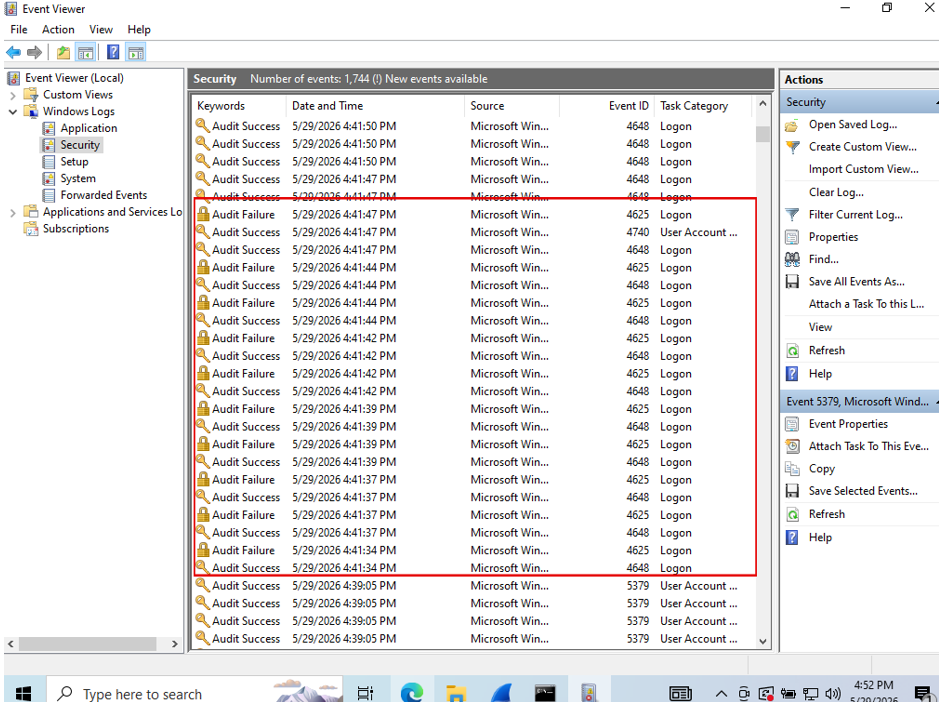
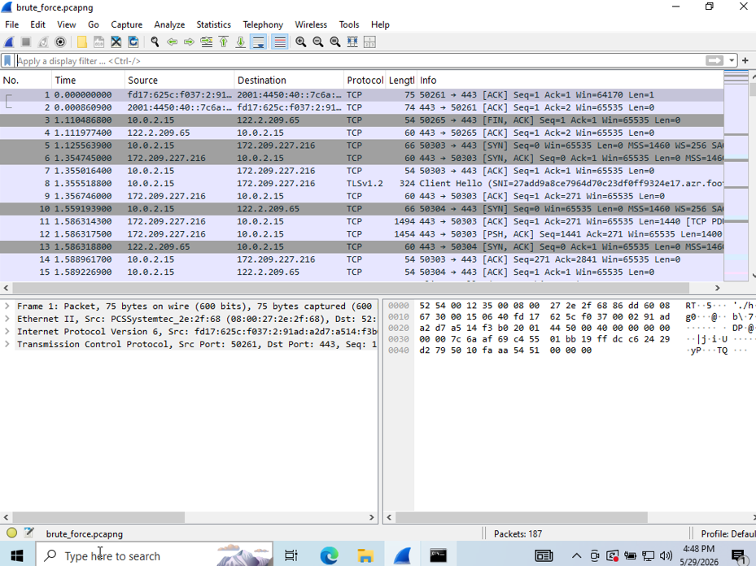

## Host-Based Event Analysis
Windows Security Event Log auditing intercepted the behavior perfectly, recording 10 consecutive instances of Event ID 4625.

---

## Visibility & Telemetry Gap Analysis
Because the traffic stayed internal, standard Npcap bindings failed to capture application-layer SMB2 protocol handshakes.

